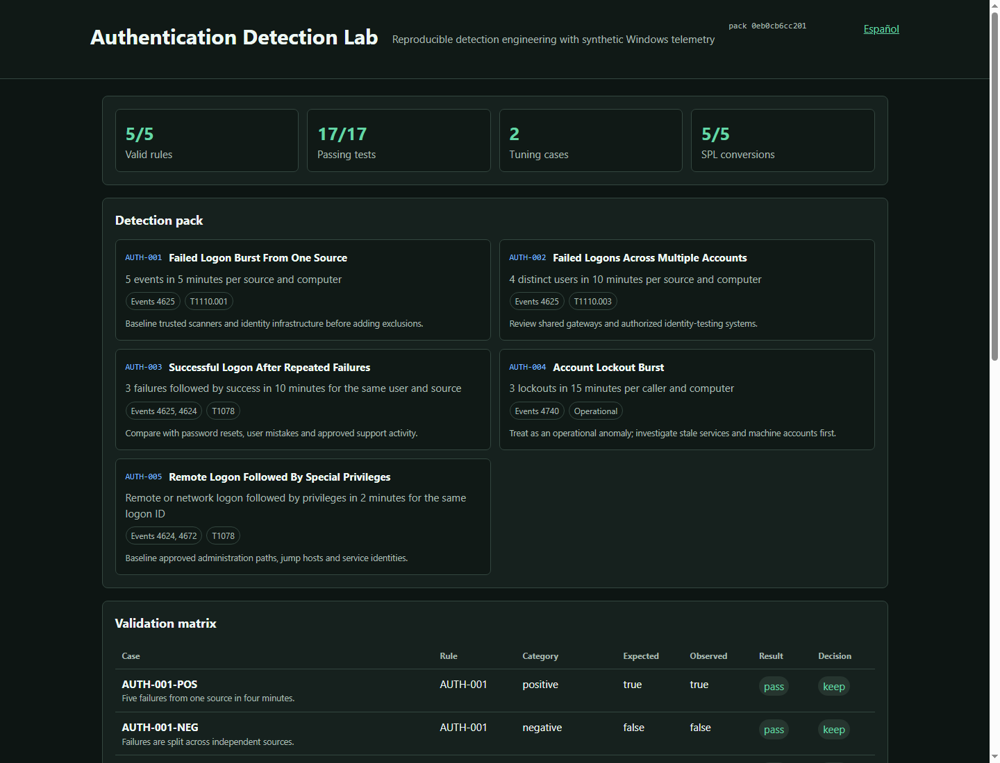

# Windows Authentication Detection Lab

[](https://github.com/rubenasuasoto/windows-authentication-detection-lab/actions/workflows/validate.yml)

[Versión en español](README.es.md)

A safe, reproducible detection-engineering portfolio project built around five
Sigma detections for Windows authentication anomalies. The lab validates rule
structure, exercises synthetic scenarios, converts supported rules to Splunk
SPL, and publishes a bilingual validation report.

> Lab-only and defensive. No real credentials, production logs, malware,
> binaries, memory access or offensive simulations are included.



## Demo

Open the guided mini-SOC demo locally:

```powershell
uv run authlab demo --open
```

The GitHub Pages URL is prepared by CI and should be shared only after the
`Publish demo site` workflow has completed successfully.

## What this demonstrates

- Sigma rule and correlation design.
- Positive, negative, boundary and tuning-oriented tests.
- Transparent handling of false positives and backend limitations.
- Reproducible validation, reporting and demo publishing through CI.
- ATT&CK-aligned detection reasoning without unsafe activity.
- Dependency and secret auditing on every proposed change.

## Detection pack

| ID | Detection | Windows events | Focus |
|---|---|---|---|
| AUTH-001 | Failed logon burst from one source | 4625 | Password guessing |
| AUTH-002 | Failed logons across multiple accounts | 4625 | Password spraying |
| AUTH-003 | Successful logon after repeated failures | 4625, 4624 | Authentication sequence |
| AUTH-004 | Account lockout burst | 4740 | Operational anomaly |
| AUTH-005 | Remote logon followed by special privileges | 4624, 4672 | Privileged session |

## Quick start

Requirements: Python 3.12 and [uv](https://docs.astral.sh/uv/).

```powershell
uv sync --extra dev
uv run authlab all
uv run authlab demo --open
uv run pytest
```

Open `reports/latest/demo.html` for the guided local mini-SOC walkthrough, or
`reports/latest/report.en.html` for the validation report. Generated Splunk
queries and machine-readable evidence are written to `artifacts/`, which is
intentionally ignored by Git.

## How to review this project

1. Run `uv run authlab demo --open` and walk through the guided synthetic cases.
2. Start with `rules/manifest.json` and the five Sigma files in `rules/`.
3. Inspect `tests/fixtures/scenarios.json` to see the positive, negative,
   boundary and tuning cases.
4. Run `uv run authlab all` to rebuild validation, SPL conversion and reports.
5. Open `reports/latest/report.en.html` for the portfolio-ready validation
   matrix.
6. Read the per-rule playbooks in `docs/playbooks/`.
7. Review `docs/ALERT_NARRATIVES.md` for analyst-facing alert summaries.
8. Read `docs/TUNING_GUIDE.md` to see how false positives are handled without
   hiding the detection behavior.

## Commands

```text
authlab validate                 Validate rules and execute safe fixtures
authlab convert --backend splunk Convert supported rules to Splunk SPL
authlab report                   Build English and Spanish reports
authlab demo                     Build the guided local mini-SOC demo
authlab demo --open              Build and open the local demo
authlab audit                    Reject unsafe or private artifacts
authlab vm-check                 Inspect VM readiness without changing Windows
authlab vm-plan                  Print the optional isolated VM validation plan
authlab list-rules               List detections and linked playbooks
authlab explain AUTH-003         Explain one detection for review or interviews
authlab playbook AUTH-001        Print one detection playbook
authlab narrative AUTH-001       Print one analyst-facing alert narrative
authlab all                      Run audit, validation, conversion and reports
```

## Important limitation

The fixture runner is an educational test oracle, not a SIEM. The Splunk
conversion uses the explicit `splunk_windows` processing pipeline. Correlation
support differs between Sigma backends, so output must be reviewed and tested
in an authorized target environment before operational use.

## Documentation

- [Architecture](docs/ARCHITECTURE.md)
- [Alert narratives](docs/ALERT_NARRATIVES.md)
- [Data sources](docs/DATA_SOURCES.md)
- [Detection catalog](docs/DETECTION_CATALOG.md)
- [Per-rule playbooks](docs/playbooks/)
- [Validation and tuning](docs/VALIDATION.md)
- [Tuning guide](docs/TUNING_GUIDE.md)
- [Portfolio presentation guide](docs/PORTFOLIO_PRESENTATION.md)
- [Release checklist](docs/RELEASE_CHECKLIST.md)
- [Optional isolated VM lab](docs/VM_LAB.md)
- [VM readiness checklist](docs/VM_READINESS_CHECKLIST.md)
- [Security policy](SECURITY.md)

## Release readiness

Version `0.1.0` is defined in `pyproject.toml`. Before tagging a public release,
use [docs/RELEASE_CHECKLIST.md](docs/RELEASE_CHECKLIST.md) and add the GitHub
workflow badge only after the remote repository URL is stable.

Licensed under the [MIT License](LICENSE).
